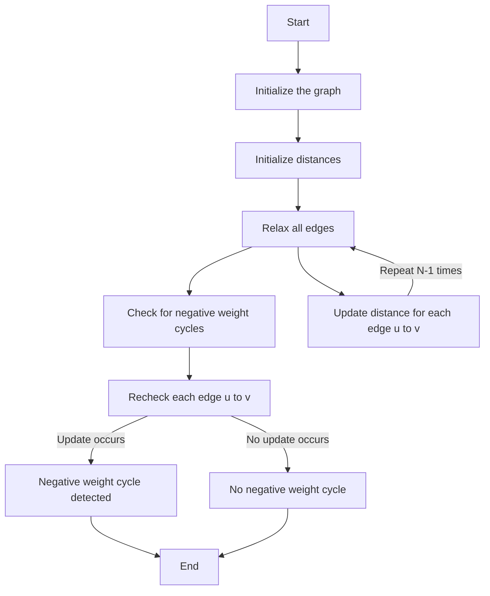

# Bellman-Ford Algorithm
This repository contains a C++ program that utilizes the Bellman-Ford algorithm to solve a problem involving the optimal arrangement of cows based on specific distance constraints.


## Bellman-Ford Algorithm
The Bellman-Ford algorithm is a graph search algorithm that computes shortest paths from a single source vertex to all other vertices in a weighted graph. It can handle graphs with negative edge weights and is capable of detecting negative weight cycles.


## Problem Description
Given N cows, each numbered from 1 to N, some pairs of cows have constraints on their distances. The cows are arranged in a single line. These constraints are:
- Some cows must be within a certain maximum distance of each other.
- Some cows must be at least a certain minimum distance apart.

Multiple cows can occupy the same position.

### Constraints
- 2 <= N <= 1000
- 1 <= ML, MD <= 10000
- 1 <= AL < BL <= N
- 1 <= AD < BD <= N
- 1 <= DL, DD <= 1000000

### Input
The input consists of:
- An integer `N`, representing the number of cows.
- An integer `ML`, representing the number of constraints for cows that need to be within a maximum distance.
- An integer `MD`, representing the number of constraints for cows that need to be at least a minimum distance apart.
- ML lines each containing three integers `AL`, `BL`, and `DL`, representing a constraint that cows AL and BL must be within a distance DL.
- MD lines each containing three integers `AD`, `BD`, and `DD`, representing a constraint that cows AD and BD must be at least a distance DD apart.

### Output
The output is a single integer representing the maximum distance between cow 1 and cow N while satisfying all constraints. If no such arrangement is possible, output -1. If cows can be infinitely far apart, output -2.

### Example
#### Input
```
4 2 1
1 3 10
2 4 20
2 3 3
```

#### Output
```
27
```


## Solution Approach
To solve the problem using the Bellman-Ford algorithm:

1. **Graph Representation**:
   - Represent the problem as a graph where each cow is a vertex. 
   - For constraints `d[AL] + DL >= d[BL]`, add an edge from AL to BL with weight DL.
   - For constraints `d[AD] + DD <= d[BD]`, add an edge from BD to AD with weight -DD.

2. **Distance Tracking**:
   - Use an array to track the distances from cow 1 to all other cows.

3. **Algorithm Execution**:
   - Run the Bellman-Ford algorithm to compute the shortest paths and detect any negative weight cycles.

4. **Result Extraction**:
   - The distance from cow 1 to cow N represents the solution. If the distance is infinite, output -2. If no valid arrangement exists, output -1.


## Author
Yuki Tsuboi