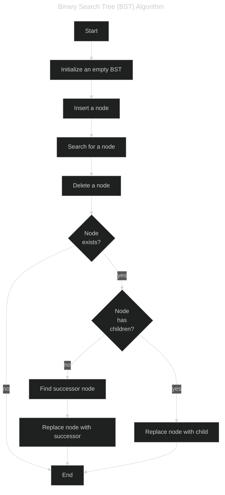

# Binary Search Tree (BST) Query Processor
This repository contains a C++ program that processes a series of queries on a set of numbers using a Binary Search Tree (BST).


## Binary Search Tree (BST)
A Binary Search Tree (BST) is a tree data structure in which each node has at most two children, referred to as the left child and the right child. For every node, all elements in the left subtree are less than the node, and all elements in the right subtree are greater than the node. This property makes BSTs useful for operations like insertion, deletion, and searching, which can be performed in **(O(log n))** time on average.


## Problem Description
Given a set of numbers `S`, process a series of `Q` queries of the following two types:
1. **Type 1**: Add a number `X` to the set `S`.
2. **Type 2**: Find and remove the `X`-th smallest number in the set `S`.

reference:https://atcoder.jp/contests/arc033/tasks/arc033_3

### Constraints
- 1 <= Q <= 200000 (number of queries)
- 1 <= X <= 200000
- Before processing a Type 1 query, the number `X` is not in the set `S`.
- Before processing a Type 2 query, the set `S` contains at least `X` numbers.

### Input
```
Q
T1 X1
T2 X2
...
TQ XQ
```
- An integer `Q` representing the number of queries.
- Query lines follow, each containing:
  - Ti=1 for a Type 1 query.
  - Ti=2 for a Type 2 query.

### Output
- For each Type 2 query, output the `X`-th smallest number in the set `S` and remove it from the set.

### Input & Output Sample
#### Input
```
5
1 11
1 29
1 89
2 2
2
```

#### Output
```
29
89
```
Explanation: After adding 11, 29, and 89 to the set, the second smallest number (29) is removed and printed. Then, the next second smallest number (89) is removed and printed.


## Solution Approach
To solve this problem efficiently, we can use a Binary Search Tree (BST) to maintain the set `S` and handle the queries. The BST will allow us to insert numbers, find the `X`-th smallest number, and delete nodes efficiently.

### Algorithm
1. **Initialize** a BST to manage the set of numbers.
2. **Process** each query in sequence:
   - For a Type 1 query, insert the number into the BST.
   - For a Type 2 query, find the `X`-th smallest number using an in-order traversal and delete it from the BST.
3. **Output** the results of Type 2 queries.


## Author
Yuki Tsuboi