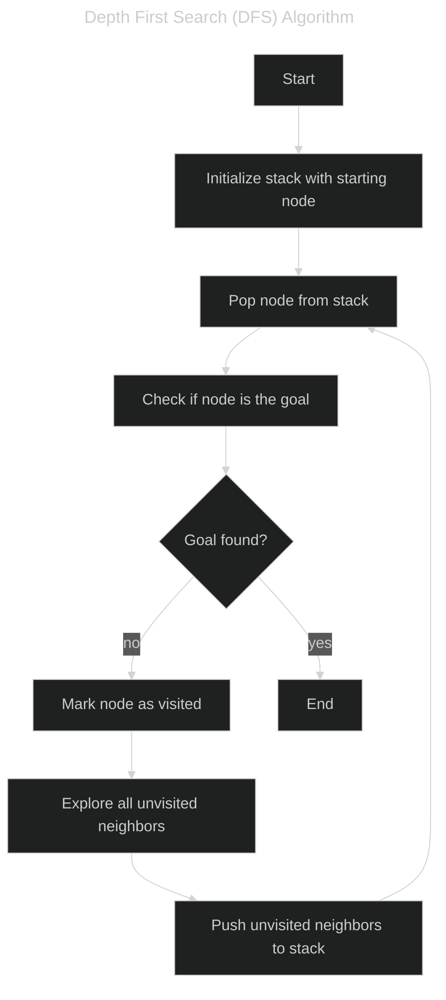

# Subset Sum Problem Solver using DFS
This repository contains a C++ program that solves the subset sum problem using the Depth First Search (DFS) algorithm.

## Depth First Search (DFS)
Depth First Search (DFS) is a graph traversal algorithm that explores as far down a branch as possible before backtracking. It is commonly used for solving problems involving searching through possible states, such as puzzle solving, pathfinding, and in this case, finding subsets of integers that sum to a specific value.


## Problem Description
Given a list of integers `a1, a2, ..., an`, determine if there exists a subset of these integers whose sum is exactly `k`.

### Constraints
- `1 <= n <= 20`
- `-10^8 <= a_i <= 10^8`
- `-10^8 <= k <= 10^8`

### Input
- An integer `n`: the number of elements in the list.
- An integer `k`: the target sum value.
- A list of `a_i` integers: the elements to choose from.

### Output
- "Yes" if there exists a subset of the given list that sums to `k`.
- "No" otherwise.

#### Input & Output sample
```
5 24 1 2 5 9 10
Yes

5 23 1 2 5 9 10
No
```

## Author
Yuki Tsuboi