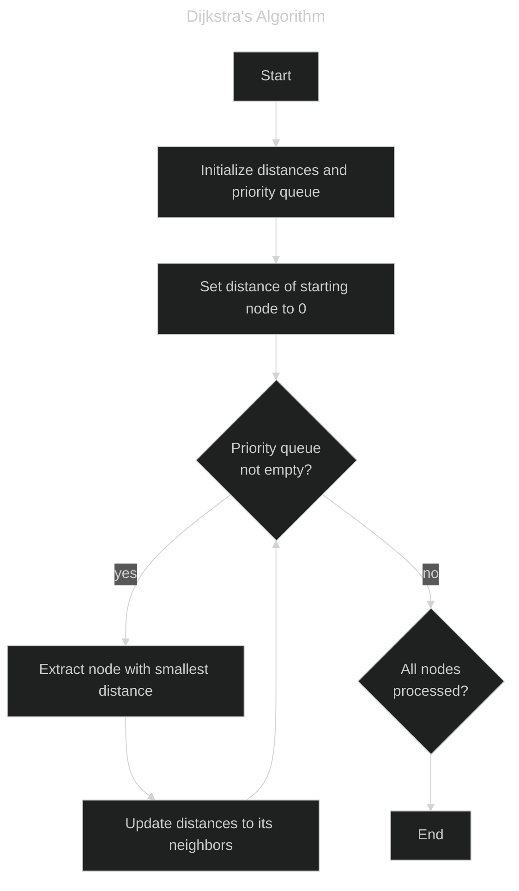

# Dijkstra's Algorithm
This repository contains a C++ program that utilizes Dijkstra's algorithm to find the second shortest path in a city with N intersections and R roads.


## Dijkstra's Algorithm
Dijkstra's algorithm is a graph search algorithm that solves the single-source shortest path problem for graphs with non-negative edge weights. It works by iteratively selecting the node with the smallest known distance from the source, updating the distances to its neighbors, and repeating the process until all nodes have been processed. This ensures that the shortest path to each node is found efficiently.


## Problem Description
Given a city with N intersections and R bidirectional roads, the task is to find the length of the **second shortest path** from the first intersection to the N-th intersection. The second shortest path is defined as the shortest path that is strictly longer than the shortest path.

### Constraints
- 3 <= N <= 5000
- 3 <= R <= 100000

### Input
```
N R
u1 v1 w1
u2 v2 w2
...
uR vR wR
```
- An integer `N` representing the number of intersections.
- An integer `R` representing the number of roads.
- `ui`, `vi`: Integers representing the endpoints of the i-th road.
- `wi`: An integer representing the weight (length) of the i-th road.

### Output
An integer representing the length of the second shortest path from intersection 1 to intersection N. If no such path exists, output -1.

### Example
#### Input
```
4 4
1 2 100
2 3 250
2 4 200
3 4 100
```

#### Output
```
450
```
Explanation: The shortest path from intersection 1 to 4 is 1 -> 2 -> 4 with a length of 300. The second shortest path is 1 -> 2 -> 3 -> 4 with a length of 450, so the second shortest path length is 450.


## Solution Approach
To efficiently solve the problem using Dijkstra's algorithm with a twist:

1. **Graph Representation**:
   - Represent the city as a graph using adjacency lists where each intersection is a node and each road is an edge with a given weight.

2. **Distance Tracking**:
   - Maintain two distance arrays: `dist1` to track the shortest path distances and `dist2` to track the second shortest path distances from the source intersection (1) to all other intersections.

3. **Priority Queue**:
   - Use a priority queue (min-heap) to manage the nodes to be processed based on the current path length, ensuring the shortest paths are processed first.

4. **Algorithm Execution**:
   - Start from the source intersection and initialize its distance in `dist1` to 0.
   - For each node processed, consider all its neighbors and update both `dist1` and `dist2` appropriately.
   - If the current path length to a neighbor is less than `dist1[neighbor]`, update `dist2[neighbor]` to `dist1[neighbor]` and `dist1[neighbor]` to the current path length.
   - If the current path length to a neighbor is between `dist1[neighbor]` and `dist2[neighbor]`, update `dist2[neighbor]` to the current path length.

5. **Result Extraction**:
   - The second shortest path from intersection 1 to intersection N is found in `dist2[N]`. If it remains as infinity, output -1.


## Author
Yuki Tsuboi
