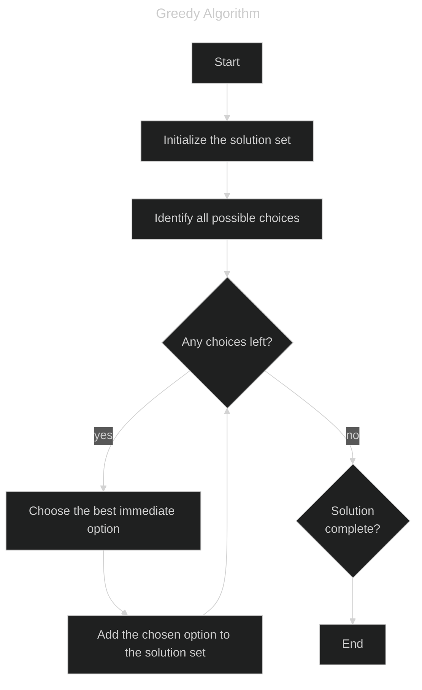

# Coin Problem Solver using Greedy Algorithm

This repository contains a C++ program that solves the coin problem using the Greedy algorithm.

## Greedy Algorithm
The Greedy algorithm is an algorithmic paradigm that builds up a solution piece by piece, always choosing the next piece that offers the most immediate benefit. It is particularly effective for certain optimization problems where locally optimal choices lead to a globally optimal solution.


## Problem Description
Given a set of US coins (1¢, 5¢, 10¢, 25¢, 50¢, 100¢) and their respective quantities, determine the minimum number of coins required to make the target amount in dollars using a Greedy approach. The program should account for the limited quantity of each coin type.

### Constraints
- `0 <= C1, C5, C10, C25, C50, C100 <= 10^9` (quantities of each coin type)
- `0 <= A <= 10^9` (target amount in cents)

### Input
- Six integers representing the quantities of 1¢, 5¢, 10¢, 25¢, 50¢, and 100¢ coins.
- A single integer representing the target amount in cents.

### Output
- A single integer representing the minimum number of coins required to make the target amount. If it is not possible to make the target amount with the given quantities, the program should output `-1`.

#### Input & Output sample
```
10 10 10 10 10 10
289

9
```
Explanation: 289¢ can be made up of 2×100¢ + 1×50¢ + 1×25¢ + 1×10¢ + 4×1¢ = 9 coins.

## Author
Yuki Tsuboi