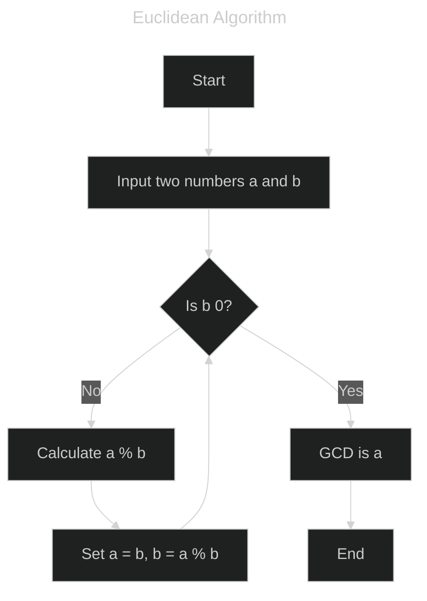

# Euclidean Algorithm for Counting Lattice Points on a Line Segment
This repository contains a Python program that uses the Euclidean Algorithm to determine the number of lattice points on a line segment between two given points, excluding the endpoints.

## Euclidean Algorithm
The Euclidean Algorithm is a method for finding the greatest common divisor (GCD) of two numbers. It is based on the principle that the GCD of two numbers also divides their difference. The algorithm proceeds by repeatedly replacing the larger number by its remainder when divided by the smaller number, until one of the numbers becomes zero. The non-zero number at this point is the GCD of the original two numbers.



## Problem Description
Given two lattice points \( P1 = (x1, y1) \) and \( P2 = (x2, y2) \) on a plane, determine how many lattice points lie on the line segment connecting these two points, excluding \( P1 \) and \( P2 \).

### Constraints
- \( -10^9 \leq x1, y1, x2, y2 \leq 10^9 \)

### Input
```
x1 y1 x2 y2
```
- \( x1, y1 \): Coordinates of the first lattice point \( P1 \)
- \( x2, y2 \): Coordinates of the second lattice point \( P2 \)

### Output
An integer representing the number of lattice points on the line segment between \( P1 \) and \( P2 \), excluding the endpoints.

### Example
#### Input
```
1 11 5 3
```

#### Output
```
3
```
Explanation: The line segment from (1, 1) to (5, 3) passes through one additional lattice point at (3, 2).

## Solution Approach
To efficiently solve the problem using the Euclidean Algorithm:

1. **Compute the Differences**: Calculate the differences in the x-coordinates and y-coordinates of the two points:
   - \( dx = |x2 - x1| \)
   - \( dy = |y2 - y1| \)

2. **Use the Euclidean Algorithm**: Determine the greatest common divisor (GCD) of \( dx \) and \( dy \) using the Euclidean Algorithm. This GCD represents the number of steps along the line segment that pass through lattice points, including the endpoints.

3. **Count the Lattice Points**: Subtract 1 from the GCD to exclude the endpoints:
   - Number of lattice points \( = \text{GCD}(dx, dy) - 1 \)

### Algorithm Steps
1. **Initialize** the coordinates of the two points.
2. **Calculate** the differences \( dx \) and \( dy \).
3. **Compute** the GCD of \( dx \) and \( dy \) using the Euclidean Algorithm.
4. **Subtract 1** from the GCD to get the number of lattice points excluding the endpoints.
5. **Output** the result.


## Author
Yuki Tsuboi
