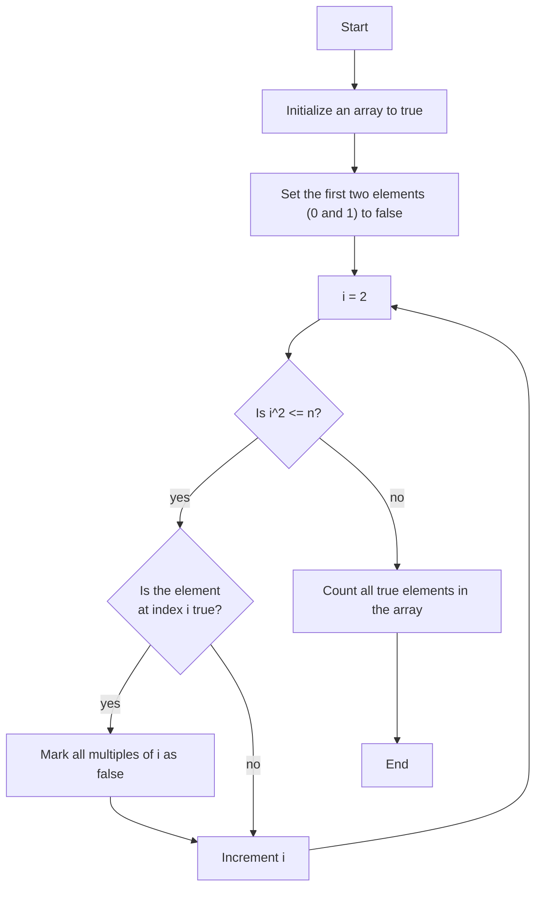

# Sieve of Eratosthenes
This repository contains a C++ program that utilizes the Sieve of Eratosthenes algorithm to count the number of prime numbers less than or equal to a given integer `n`.

## Sieve of Eratosthenes
The Sieve of Eratosthenes is an efficient algorithm for finding all prime numbers up to a given limit. It works by iteratively marking the multiples of each prime number starting from 2.




## Problem Description
Given an integer `n`, determine how many prime numbers are less than or equal to `n`.

### Constraints
- `1 <= n <= 10^6`

### Input
```
n
```
- An integer `n` representing the upper limit.

### Output
An integer representing the number of prime numbers less than or equal to `n`.

### Example
#### Input
```
1000000
```

#### Output
```
78498
```


## Solution Approach
To efficiently solve the problem using the Sieve of Eratosthenes:

1. **Initialize** an array of boolean values, where each index represents whether the number is prime.
2. **Mark** the first two indices (0 and 1) as false since 0 and 1 are not prime numbers.
3. **Iterate** from 2 to the square root of `n`. For each number that is still marked as true, mark all of its multiples as false.
4. **Count** the number of indices that are still marked as true. These represent the prime numbers.

By following this approach, we can efficiently determine the number of prime numbers up to a given limit `n`.


## Author
Yuki Tsuboi
