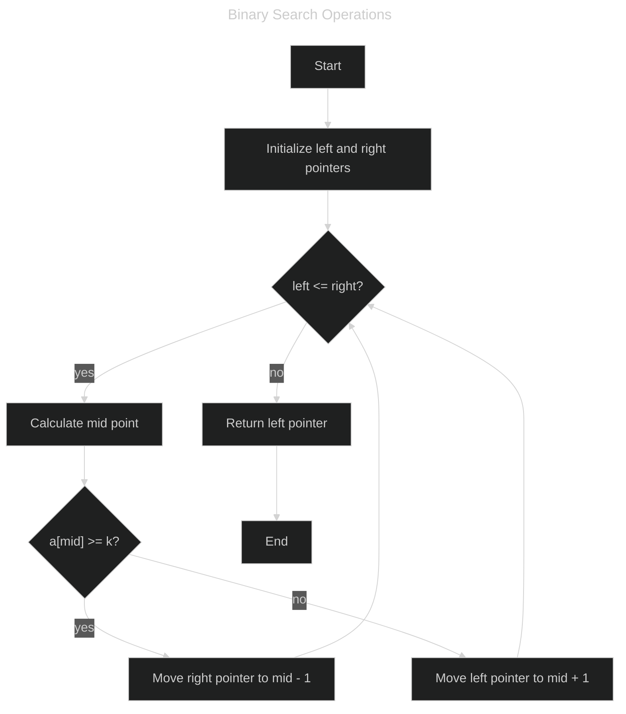

# Binary Search Algorithm
This repository contains a C++ program that utilizes the Binary Search algorithm to efficiently find the smallest index in a sorted array where the value is greater than or equal to a given target.


## Binary Search Algorithm
Binary Search is a powerful algorithm used to find an element in a sorted array in logarithmic time. It works by repeatedly dividing the search interval in half and comparing the target value to the middle element of the interval. This method ensures efficient searching with a time complexity of O(log n).




## Problem Description
Given a sorted array of length `n` and a target value `k`, find the smallest index `i` such that `a[i] >= k`. If no such index exists, return `n`.

### Constraints
- 1 <= n <= 10^6
- 0 <= a0 <= a1 <= ... <= an-1 < 10^9
- 0 <= k <= 10^9

### Input
```
n k
a0 a1 a2 ... an-1
```
- An integer `n` representing the length of the array.
- An integer `k` representing the target value.
- An array of `n` integers in non-decreasing order.

### Output
An integer representing the smallest index `i` such that `a[i] >= k`. If no such index exists, return `n`.

### Example
#### Input
```
5 3
2 3 3 5 6
```

#### Output
```
1
```
Explanation: The smallest index where the value is greater than or equal to 3 is index 1.


## Solution Approach
To efficiently solve the problem using Binary Search:

1. **Initialize** the left and right pointers to the start and end of the array, respectively.
   
2. **Iterate** while the left pointer is less than or equal to the right pointer:
   - Calculate the middle index.
   - Compare the middle element to the target value `k`.
   - If the middle element is greater than or equal to `k`, update the right pointer to mid - 1.
   - If the middle element is less than `k`, update the left pointer to mid + 1.

3. **Return** the left pointer as it will point to the smallest index where `a[i] >= k` or `n` if no such index exists.

By using Binary Search, the algorithm ensures that the search is performed in logarithmic time, making it highly efficient for large arrays.


## Author
Yuki Tsuboi
